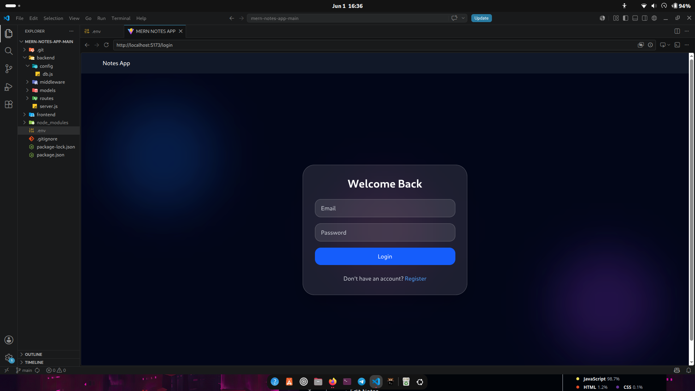
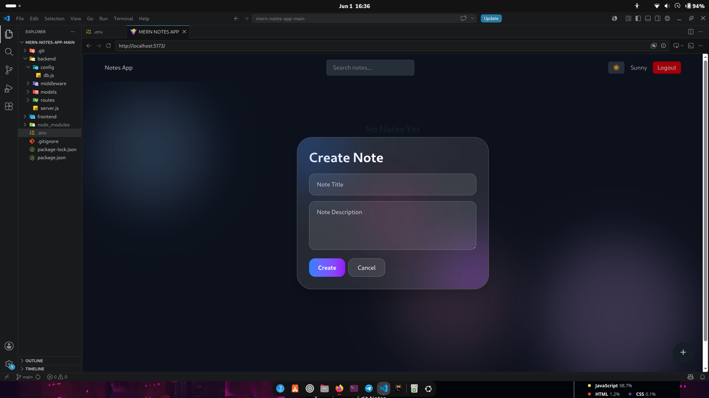

# MERN Notes App

A full-stack notes application built using the MERN stack.

## Features

- User Authentication (JWT)
- Create Notes
- Edit Notes
- Delete Notes
- Protected Routes

## Tech Stack

- React
- Node.js
- Express.js
- MongoDB
- JWT Authentication

## Installation

### Backend

```bash
cd backend
npm install
npm run dev
```

### Frontend

```bash
cd frontend
npm install
npm run dev
```

## Future Improvements

- Note categories
- Search functionality
- Dark mode

## Screenshots

### Login Page



### Dashboard



# MERN Notes App

A full-stack notes application built using the MERN stack.

## Live Demo

https://mern-notes-app-rp45.onrender.com

## Features

- User Authentication (JWT)
- Create Notes
- Search Notes
- Responsive UI

## Author

Sunny Kumar
